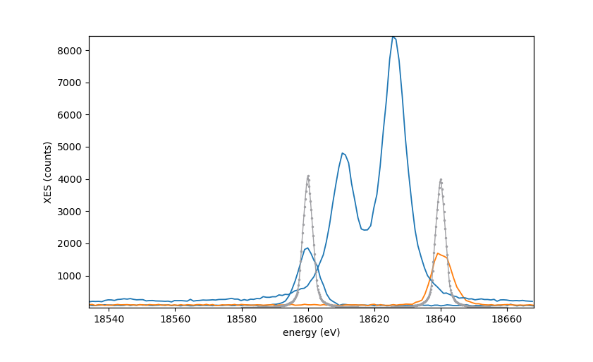

XES theta scans
===============

A pipeline for the ParSeq framework (link) that implements data processing of
XES theta scans, where the crystal (here only one) is scanned in its theta
angle and the analyzed emission is collected by a 2D detector.

This pipeline also serves as an example for creating analysis nodes, transforms
that connect these nodes and widgets that set options and parameters of the
transforms.

  

Dependencies
------------

- [ParSeq](https://github.com/kklmn/ParSeq) -- the framework package.
- [silx](https://github.com/silx-kit/silx) -- is used for plotting and Qt imports.

How to use
----------

Either install ParSeq and this pipeline application by their installers or put
their folders near by, rename them as `parseq` and `parseq_XES_scan` and run
`python XES_scan_start.py`. You can try it with `--test` to load test data
and/or `--noGUI` but an assumed pattern is to load a project file; use the test
project file located at `parseq_XES_scan/saved/NbO2.pspj`.
