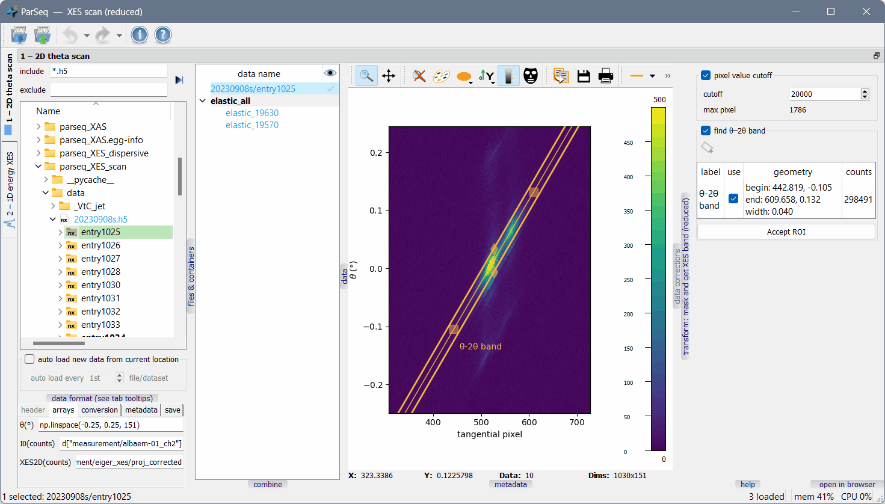
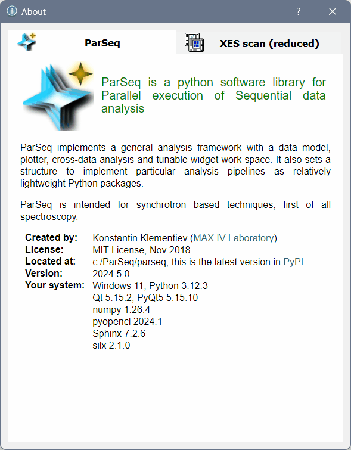

Scanning XES
============

A pipeline for the [ParSeq framework](https://github.com/kklmn/ParSeq) that
implements data processing of XES theta scans, where the crystals are scanned
in their theta angle and the analyzed emission is collected by a 2D detector.

This pipeline also serves as an example for creating analysis nodes, transforms
that connect these nodes and widgets that set options and parameters of the
transforms.

  

  

Dependencies
------------

* [ParSeq](https://github.com/kklmn/ParSeq) -- the framework package,
* [silx](https://github.com/silx-kit/silx) -- used for plotting and Qt imports.

How to use
----------

Either install ParSeq and this pipeline package by their installers
(`python -m pip install .`) or run without installation by putting their
folders `parseq` and `parseq_XES_scan` in the same folder and run
`python XES_scan_start.py --help` to see the accepted run options. Run the
pipeline as `python XES_scan_start.py` or by `parseq-XES` command if the
packages were installed. Load a ready project from `saved` folder from the GUI
or from the starting command line.
